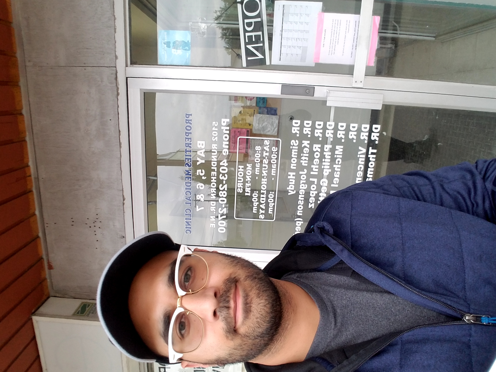
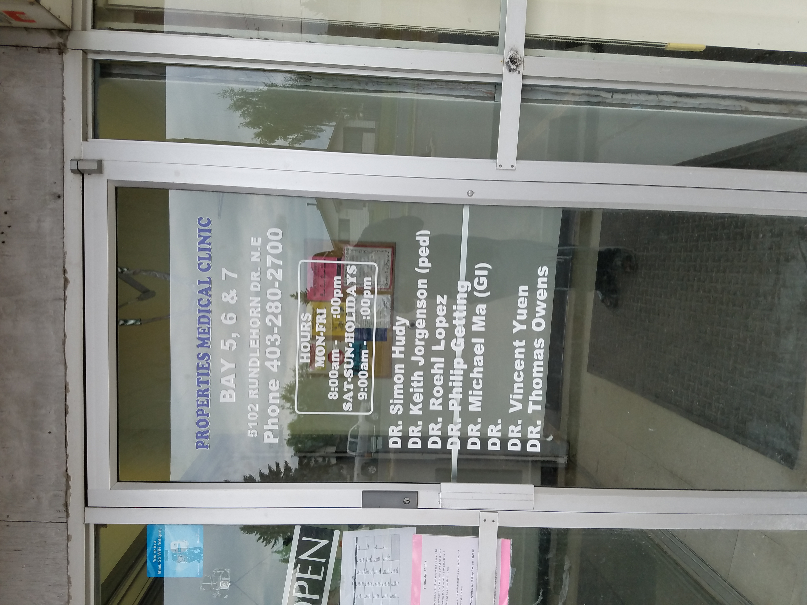
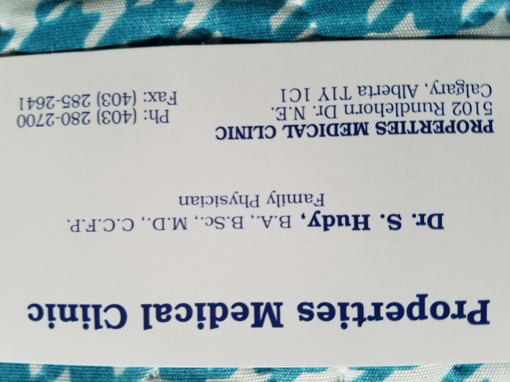
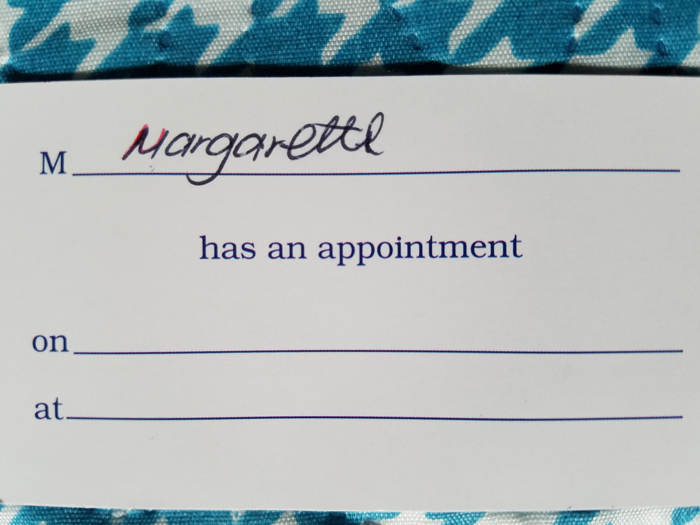
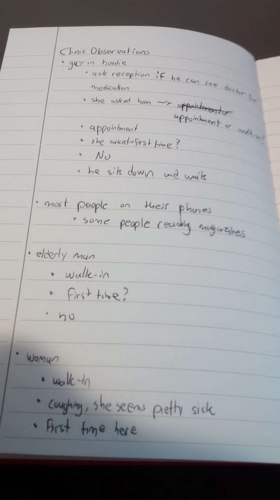
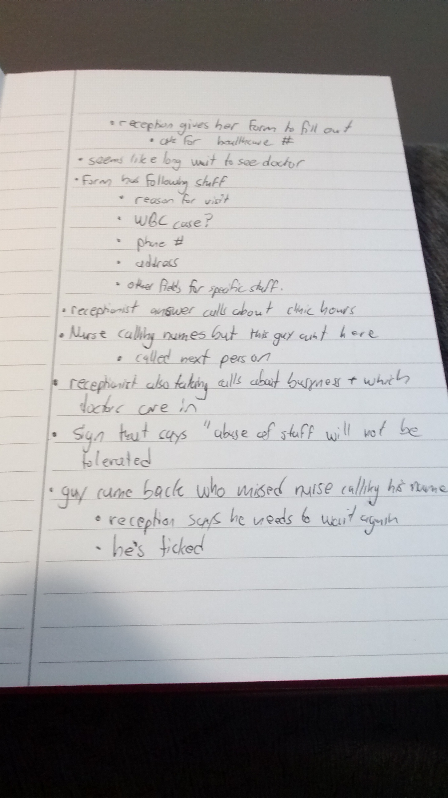

# P1: Patient Waitlist Application
## Introduction
Waiting in line can be a frustrating experience. It can be even more frustrating
when you’re sick. Patients across Canada often face long wait times to see
medical professionals. Walk-in clinics, especially those in population dense
areas, can have wait times that prevent patients from seeing a doctor for hours.
Thus, our project idea is a system specifically for targeting the problem of
walk-in clinic waitlist times and overall waitlist efficiency.

## Project Idea
Our project idea is a comprehensive patient waitlist system for use in walk-in
clinics. The goals of the system are to allow patients to check in to walk-in
clinics either ahead of time or in the clinic, to provide patients with accurate
updates as to where they are in the waitlist and estimates of their respective
wait times, and provide receptionists with a simple interface that allows them
to manage the waitlist. The system will need three components: a component that
displays the waitlist on a large monitor in the clinic, allowing patients to
easily see their place in line and their estimated wait times; an application
that allows patients to check in to the clinic of their choice before they
arrive, check their place in line, and check their estimated wait time; and a
component that the receptionist will use to manage the waitlist from within the
clinic.

There are two fundamental workflows that will characterize the system. The first
workflow will involve patients going directly to the walk-in clinic and checking
in with the receptionist. The receptionist, after verifying the patient’s
information, will enter the patient into the waitlist, at which point the
patient’s name will appear on the waitlist as displayed on a monitor in the
clinic. The second workflow will involve the patient checking in through the
mobile app. After selecting which clinic they want to go to, the patient will
check in and, upon the confirmation of the receptionist, will be placed in the
waitlist (as viewable from both the monitor in the clinic and the mobile
application). In both instances, patients will be removed from the waitlist by
the receptionist once their wait is over and they are attended to by the clinic
staff. Therefore, there will be two primary types of users of the system,
receptionists and patients. 

We expect the patient component will be used as a mobile smartphone/tablet
application for a popular platform. The receptionist and the display components
will likely be implemented on desktop platforms. Special context for this system
might be that patients are sick/injured while using the mobile app and
receptionists might be busy while using their component.

## Summary of Key Factors
- People continuing to ask where their place in line is (receptionist)
- Receiving phone calls from clients asking how busy it is (receptionist)
- Not knowing how long I have to wait (patient)
- Not knowing place in line (patient)
- Fear that if I leave that my name will be called and I have to wait all over
  again (patient)
- Don’t want to wait in uncomfortable chairs in a clinic that is that is filled
  with other sick people (patient)

## Stakeholders
### Patients
The patients are one of the primary end-users of the system and are thus an
important stakeholder for us to consider. They will be using the system to check
into the clinic either remotely or through the receptionist. The background
knowledge and technological literacy of patients may vary drastically, thus the
system will have to be implemented by ensuring it is easy enough to use for many
different backgrounds and should include sufficient help-related documentation.

### Receptionists
The receptionists are anther major stakeholder of the system. They will have
access to more administrative functionality of the system such as adding and
removing patients from the waitlist, and other configuration related settings.
Background knowledge of clinic-related activities is expected to be sufficient
but technological literacy of receptionists may vary, thus receptionists may
have to be trained to use the system prior to deployment. Furthermore,
receptionist-specific help documentation will be provided for the system.

### Doctors
Doctors are not expected to interact with the system as frequently as
receptionists, but the system will provide support for doctors for whenever they
need to access it. Like receptionists, doctors will have access to the
administrative functionality of the system like adding/removing patients from
the waitlist and other configuration settings. Also like the receptionists, it
is likely that doctors will have background knowledge in general clinic-related
activities but their technological literacy may vary. However, doctor-specific
training will likely be unnecessary due to their rare interaction with the
system since waitlist related activities are generally managed by the
receptionist.

## Research Methods
1. Interviews
2. Fly on the wall

### Justification for Methods
The Interview and Fly-on-the-wall methods complement each other nicely. The
former is an “Ask” method, whereas the latter is a “Look” method. Additionally,
each method has individual benefits, as described below:

#### Interview
1. We chose to use short open ended interviews because we believed that the
   detailed qualitative information that we received from this method would help
   us better understand all of the different stakeholders and how we could
   address their various needs.
2. Gives the interviewees the chance to bring up key points on the design issue
   that the interviewer did not think of.
3. Gives us a more direct and personal understanding about the design issue.

#### Fly on the Wall
1. We chose passive observation to observe processes not mentioned in the
   interviews (We get to see what people actually do within real contexts and
   time frames, rather than accepting what they say they did after the fact)
2. Lowcost/effort to get qualitative data
3. Provides minimal bias and influence from the researcher
4. This can be done at any place

## Summary of Research Methods
### Interview
An interview consists of a formal meeting between two people, where questions
are provided by the interviewer, for the interviewee. This procedure is designed
with a specific purpose, to obtain information, qualities, attitudes, wishes,
etc. from the interviewee. One of the most common types of interviews for this,
is the structured interview, which follows formal procedure where the
interviewer will ask predetermined questions. The interviewer has to make sure
that the questions are open ended, and cover as much topics from the information
that is desired from the interviewee.

To conduct the interviews, we visited a walk-in clinic and introduced ourselves
as University of Calgary students that were working on a class project to help
improve the experience of patients and staff for walk-in clinics. We interviewed
three patients and a receptionist. A doctor was not available to participate.

#### Questions for Patients
1. Do clinic wait times bother you? If so, what specifically about them bothers
   you?
2. Would you be interested in a mobile app or website that allows you to check
   in to a clinic from home? What features would you be interested in if we made
   one?
3. What information is important to you before you go to a clinic / while you
   are at the clinic?

#### Questions for Receptionist
1. Please describe some of your daily tasks, and explain how patients are
   matched with doctors and how the waitlist works, and any troubles you face
   daily that could perhaps be addressed
2. Do you think an App with a visualized waitlist would be beneficial to you and
   what features would you like to see?

#### Receptionist
She said she was responsible for adding patients to her office’s current system
to be seen by the available doctors, getting the patient’s file ready before
they were seen by the doctors, scheduling appointments, completing tasks for the
physicians, helping with administrative work, and answering phone calls. They
use 2 lists. One for walkins and one for scheduled appointments. They also used
an application called Medimap.ca where they enter the time it takes to see each
patient so average estimates can be given. However when a client asks how long
it will take they don’t quote the data since it is often off and clients get
upset if the wrong time is quoted. 

She said that some of her key annoyances were:
- Patients continuously asking for their place in line
- Receiving phone calls asking for the hours of the clinic and how busy it is
- Aggression from patients that are mad about their wait times

She said that an application could be very beneficial however it must be very
simple to use so that she doesn’t have to dedicate extra time to using it on top
of her already heavy workload, and it needs to always be working so that it’s
not a hassle to use i.e. no freezes and still working when the internet is down

#### Patient 1 (Anonymous to protect privacy)
This patient is an older gentlemen. We asked him if it bothers him that he has
to wait to see a doctor. He replied that he doesn’t mind waiting for small
amounts of time but that it can be a little frustrating once the wait-times
start becoming longer. We asked him if there is anything specific that bothers
him about the wait. He complained that the process of checking in and waiting
lacks transparency. He said he would like to know approximately how long it will
take for him to see a doctor for a given visit, but that clinic staff don’t
share this information.

The patient does not own a smartphone, so he didn’t think a smartphone
application would be of any use. He thought he might find a website a little
useful, but said that he was more concerned about his experience in the clinic
itself. He thought it would be great if the waiting list information was visible
and updated to everyone sitting in the clinic. When asked what information is
important to him, he said the only information he would like aside from the
waiting times would be which doctors are in on a given day. 

#### Patient 2
This patient said her main complaint was that wait times are too long. For her,
going to a walk-in clinic means spending a significant portion of her day
waiting at the walk-in clinic when she could be doing other things. As a result,
she only goes when she feels it is really necessary. She couldn’t schedule an
appointment with her family doctor on short notice so the walk in clinic was her
only option. She strongly disliked waiting and was afraid to go home and come
back since she didn’t want to miss having her name called and have to wait even
more.

She said she was interested in an application where they could check-in from
home. She said it would be nice to be able to monitor her wait time from home
and come in when it is her turn. She expressed that she didn’t like waiting in
the clinic with sick people. She listed wait times, clinic busyness, and general
clinic information, such as clinic hours as the information that is important to
her.

#### Patient 3
This patient said he rarely goes to the walk-in clinic. He said he wasn’t
bothered by the wait times because “that’s just how clinics are.” However, he
did concede that it would be nice to know his place in line.

He said the app sounds like a good idea but that he would only use it if it was
convenient because of how little he goes to walk-in clinics. When asked about
what information is important to him, he mentioned that when he was deciding
what clinic to go to he picked one that was close to him and had a good rating.
He also said clinic busyness would have been nice to know so he could pick the
clinic with the shortest wait.

### Fly on the Wall
This method consists of observing and recording the behaviour of the
participants’ activities within its context. This allows us to secretly collect
information just by looking and listening, separating the researcher from any
direct involvement. This minimizes bias and researcher influence on the data
collected. However there is a limit to the understanding of the researcher about
the participants, since this method does not allow the researcher to follow up
on the participants’ experience. Being discrete and taking notes are the key to
a successful observation. Trying to blend in will help the researcher minimize
any unnatural behaviour from the participants, which helps create more valid
data. 

A team member sat in the clinic for approximately 30 minutes and observed the
behavior of patients and staff. When a person walked in the receptionist asked
them if they were in for an appointment or walk in. After that she asked them if
it was their first time there. If they said yes she handed them a form to fill
out and asked for their alberta health card number. If the patient answered no
she asked them to write down their name on the list and to have a seat. The list
had areas for the client to fill out: a box for reason of visit, is this a WBC
case, phone number, and address.

Observing the patients waiting in the clinic, the team member observed that most
of them were on their phones or reading. A nurse would come out and call a name
and that person would get up and go into the doctor’s office. If the person did
not respond the nurse called out the name multiple times, crossed out the name
and called the next one. The receptionist answered phone calls and told people
which doctors were on, how busy the clinic was, and the hours of the clinic.
There was one incident where a patient walked in after his name was called. The
receptionist said he would have to wait all over again so he stormed off and out
of the office. There was a “abuse of staff will not be tolerated” sign posted on
the receptionist’s desk. 

## Reflection on Research Methods
Regarding our research methods, our choice to use interviews proved to have
benefits and drawbacks. Considering the benefits, we were able to gather
detailed responses from three different types of patients, which was highly
beneficial to our understanding of how different patients would use the system.
Our interview with the receptionist was also very insightful, and we feel that
the level of detail we got from her responses would have been difficult to
gather from a more indirect research method, such as a survey. That said, we
were not able to sit down with anyone and have a formal interview. When our team
member went to the walk-in clinic, the receptionist was on duty and couldn’t
provide a longer interview like we would have hoped. Likewise, the patients we
interviewed were sick and waiting to see the doctor. So while we think our
choice of using interviews was the correct one, given the chance we would have
tried to schedule a couple formal interviews with people that could have talked
longer. Another drawback of using interviews in this case was that they limited
the size of the pool of users we gathered research data from. A survey would
have been helpful in this regard, especially because it could have been quickly
distributed to many people to gather a larger amount of data.

Our use of Fly-on-the-Wall observation was positive overall. We were able to
gather observational data in a non-intrusive way, which ensured that our
presence at the clinic didn’t affect the data we recorded. Moreover, we were
able to draw some insights into how the process of checking in to a walk-in
clinic works, the roles that receptionists and nurses play in the process, and
what receptionists are currently doing to manage wait times. The primary problem
with this method was the time constraints the team was under. Our team member
was only able to observe the clinic for approximately half-an-hour, limiting the
amount of data he was able to collect. Had we had more time, we could have spent
hours in the clinic gathering more data about user-scenarios and small things
that would make our system more useful. It also would have been ideal if we had
visited multiple clinics, as it seems likely that the check-in process varies to
some extent for each clinic.

## Task Descriptions
1. Patients will open the mobile/web component and browse through available
   walk-in clinics based on proximity, rating, and busyness.
2. Patients will select clinics and view general information about them (which
   doctors are in, office hours, location information, etc.)
3. Patients will “check in” to the clinic that best satisfies their requirements
4. After checking in, patients will return to the mobile/web component to see
   their expected wait times and decide when it is time to go to the clinic.
5. Receptionists will enter walk-in patients directly into the waitlist from
   their component.
6. Displays in the walk-in clinic will show the order of patients and the
   estimated wait times for each of them
7. Receptionists will have the ability to rearrange the waitlist and remove
   people from it using their desktop component
8. The display component will make a sound indicating that a patient’s wait time
   is over and that the doctor will see them now

## Proof of Research
### Walk-In Clinic

### Walk-In Clinic (alternative)

### Doctor's Business Card

### Business Card with Receptionist's Name

### Observation Notes

### Observation Notes (alternative)

